# 🌿 EcoChain AI: Autonomous Multi-Agent Sustainable Supply Chain

[](https://nextjs.org/)
[](https://fastapi.tiangolo.com/)
[](https://deepmind.google/technologies/gemini/)
[](https://deepmind.google)
[](https://www.openstreetmap.org/)
[](#)
[](https://github.com/tdhanesh1992)

> ⚡ **This project was vibecoded with Google Antigravity.**

**EcoChain AI** is an end-to-end, autonomous multi-agent platform designed for sustainable retail supply chains. Powered by **Google Gemini 3.6 Flash**, the system orchestrates predictive inventory balancing, seasonal demand surges, delivery truck routing with **Sustainable Autofill Mode**, live **OpenStreetMap** vehicle tracking, and mandatory **Human-in-the-Loop** authorization gates.


---

## 📸 Core Capabilities & Live Screenshots

### 1. Modern Role-Based Landing & Authentication
Instant portal access tailored for specific organizational roles with dedicated tabs and permissions:

#### 🏢 Management & Operations Roles (Full Dashboards)
- **Store Manager** (*Alice Chen*): Retail stock buffers, festive promotions, store restock authorization.
- **Logistics Coordinator** (*Charlie Davis*): Delivery truck fleets, customs tariff pricing verification, EV breakdown diversion.
- **Warehouse Manager** (*David Vance*): Fulfillment pipeline oversight, capacity auditing, and facility bin allocation.
- **Warehouse Operator** (*Bob Smith*): Facility inventory management, emergency restock manifests.
- **Sustainability Director** (*Elena Rostova*): Net-Zero carbon audits, ESG vendor scores, green compliance.

#### 📦 Warehouse Floor Staff (Restricted To-Do Table Only)
- **Picker Staff** (*Pete Picker*): Picks inventory from designated aisles/bins; fulfills urgent QC replacement tasks.
- **Packer Staff** (*Paula Packer*): Boxes products with eco-packaging; quarantines defective batches.
- **Quality Control Inspector** (*Quinn QC*): Audits packaging integrity, scans barcodes, and logs damaged stock.
- **Loading & Dispatch Crew** (*Leo Loader*): Stages cargo pallets and loads certified shipments onto EV trucks.
- **Put-away & Storage Clerk** (*Sammy Storage*): Unloads inbound supplier shipments and bins items into storage.

##### Management & Operations Portal
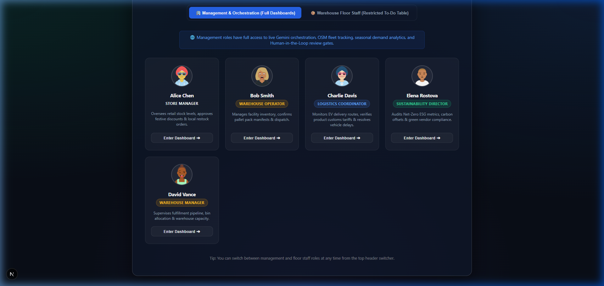

##### Warehouse Floor Staff Portal (Restricted Roles)
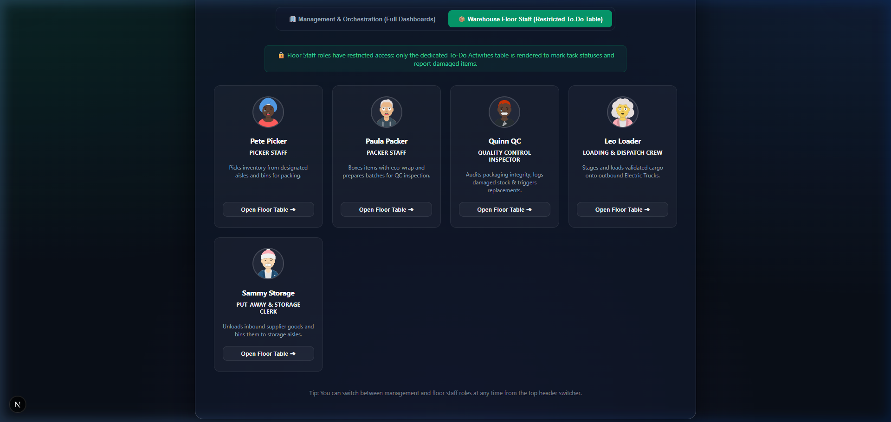

---

### 2. Mission Control & Autonomous Multi-Agent Deliberation Network
Live telemetry showing real-time net carbon offsets, zero-emission fleet ratios, and inter-agent message exchanges between specialized agents:
- 🍁 **Seasonal Agent** detects upcoming holidays & calculates promotional discount curves.
- 📦 **Inventory Agent** monitors regional warehouse buffer depletion and predicts stockouts.
- 🚚 **Logistics Agent** bundles freight with Sustainable Autofill to achieve 90% pallet density.
- 🌿 **Sustainability Agent** certifies routes for carbon compliance and logs CO2 savings.
- 🧠 **AI Orchestrator** manages consensus, task routing, and workflow synthesis.

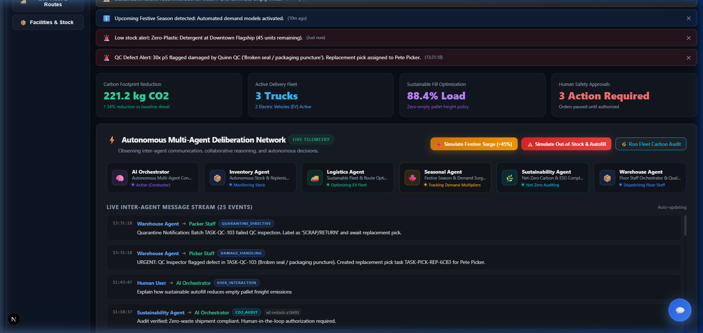

---

### 3. Live Delivery Truck Fleet Tracking via OpenStreetMap (OSM)
Interactive geospatial map displaying warehouses, retail stores, ethical vendors, and real-time delivery truck locations:
- Real-time GPS coordinates, vehicle powertrain telemetry (Electric EV vs. Hybrid Bio-Diesel).
- Visual dashed eco-corridors connecting Central Hubs (Chicago) to Flagship Retail Stores (New York) and Vendor Hubs (Portland).
- One-click **Sustainable Autofill** toggle to eliminate empty pallet freight miles.

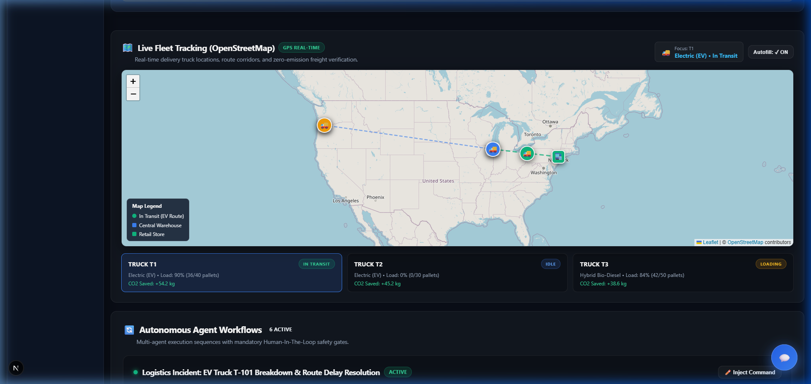

---

### 4. Human-in-the-Loop Operational Review Gate
Before any auto-generated restock or promotion can proceed to warehouse dispatch, a mandatory operational gate requires human review:
- **Issues & Notifications**: Festive demand spike warnings, store safety stock depletion alerts.
- **Order Manifest Breakdown**: Item quantities, pallet density, origin/destination, and assigned EV truck.
- **Required Verification Checklist**: Interactive checklist ensuring verification of discount margins, pallet allocations, and zero-emission routing.
- **Operator Notes / Comments**: Field allowing the operator to input custom instructions (e.g. *"Verified tariff code #ECO-994 and pricing of $39.99 for customs declaration."*).
- **Cycle Modification**: Provision to dynamically steer operational directives before confirmation.

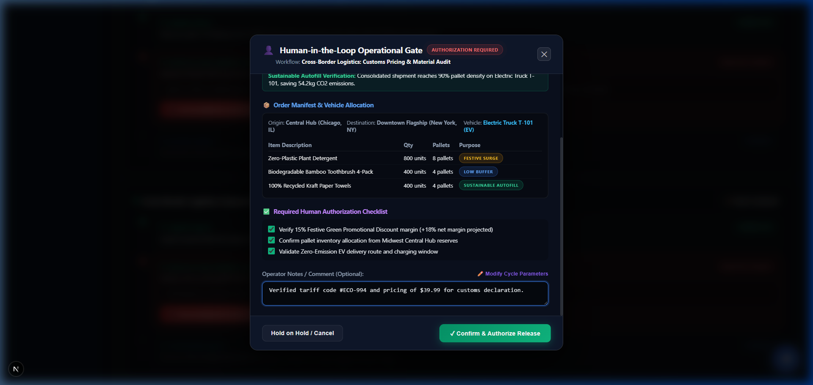

---

### 5. Seasonal Demand & Festive Surge Analytics
An interactive visualization provided by the **Seasonal Agent**:
- **Historical Demand Comparisons**: Analyzes past festive seasons (2023, 2024, 2025) vs. the active **2026 AI-Predicted Festive Surge** (+45% spike, 118,500 projected demand).
- **Interactive Metric Views**: Toggle between **Volume (Units Sold)**, **Surge Spike (%)**, and **Stockout Prevention (%)** (reduced from 8.4% in 2023 to 1.2% in 2026).
- **Proactive Green Discount Promotion**: Automatically applies a 15% green promotional discount and prompts the human operator to pre-stock inventory.

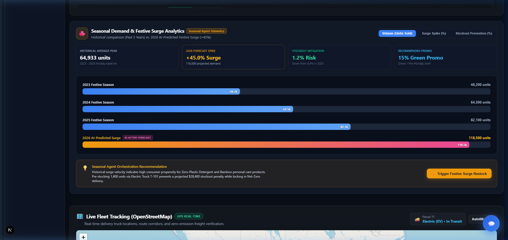

---

### 6. Specialized Human-in-the-Loop Scenarios for Logistics & Operations
Expanded Human-in-the-Loop approval workflows for critical supply chain events:
- **Customs Pricing & Material Verification** (*Logistics Coordinator*): Verifies catalog pricing ($39.99) and certified sustainable material descriptions under tariff code `#ECO-994` before international clearance.
- **EV Truck Breakdown & Route Delay Resolution** (*Logistics Coordinator*): Responds to telemetry thermal warnings for Electric Truck T-101 to authorize diversion to Rapid Megawatt Charger Station E-4 vs. transshipment to backup EV Truck T-102.
- **Festive Season Pre-Stocking** (*Store Manager*): Confirms multi-agent replenishment manifest and 15% green discount rollout.

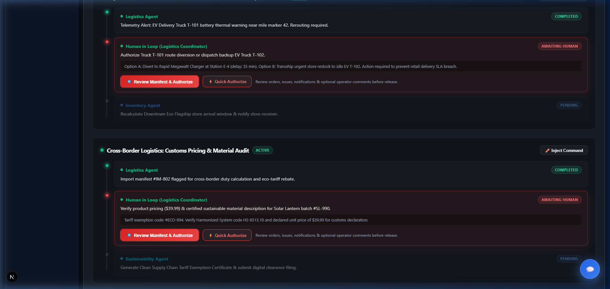

---

### 7. Dedicated Warehouse Agent & Role-Restricted Floor Operations
A dedicated **Warehouse Agent** coordinates physical floor operations across 5 specialized roles:
- 🛒 **Picker Staff** (Pete Picker): Picks items from warehouse aisles and bins.
- 📦 **Packer Staff** (Paula Packer): Eco-boxes and packages items for inspection.
- 🔍 **Quality Control Inspector** (Quinn QC): Audits seal integrity, scans barcodes, and logs defects.
- 🚛 **Loading & Dispatch Crew** (Leo Loader): Stages pallets and loads zero-emission EV trucks.
- 📥 **Put-away & Storage Clerk** (Sammy Storage): Receives inbound vendor shipments and updates storage bins.

#### 🔒 Strict Role-Based Screen Restrictions
Floor staff logins are strictly locked down to a dedicated **Warehouse Floor Operations Board** (To-Do Activities table only). They have zero access to corporate financial dashboards, executive KPIs, or fleet routing controls:

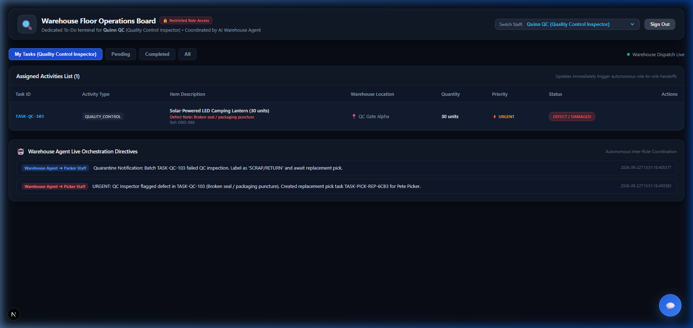

#### 🔍 Quality Control Damaged Goods Logging Modal
When the **Quality Control Inspector** audits items and detects defects (e.g. broken seal, crushed box, moisture damage), an inspection failure report is filed:

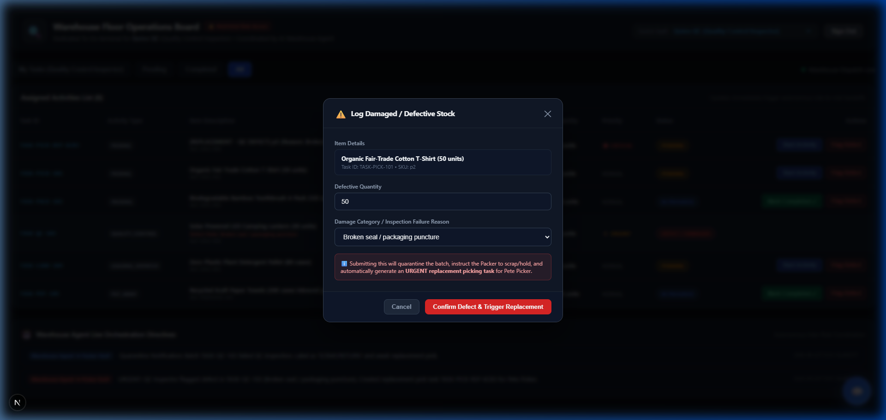

#### ⚡ Autonomous Multi-Role Hand-Off Directives
1. The batch is quarantined and instructions are sent to Packer Staff to scrap or hold.
2. The **Warehouse Agent** autonomously generates a high-priority replacement picking task (`TASK-PICK-REP`) for **Pete Picker**:

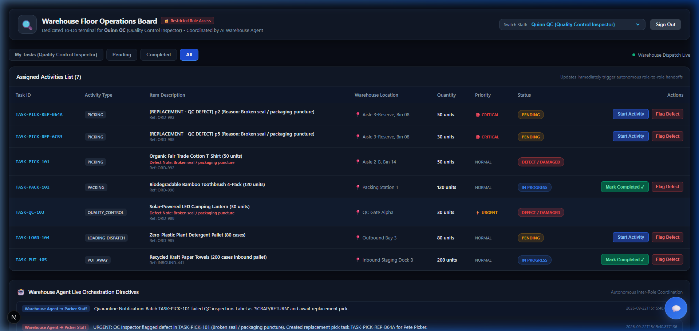

#### 📋 Pete Picker Urgent Replacement Queue
When **Pete Picker** logs in, the newly generated replacement pick task appears immediately in his assigned queue marked with **CRITICAL** priority:

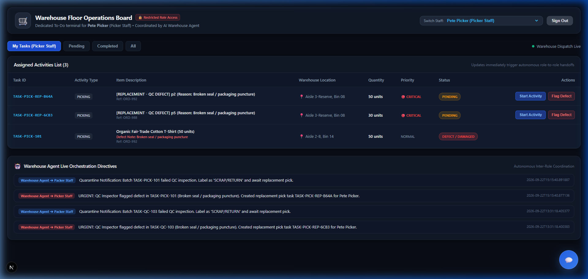

---

### 8. Multi-Agent Gemini Chat Drawer with Deliberation Trace
Direct interactive consultation drawer allowing users to query the multi-agent team or focus on a specific agent:
- Direct synthesis powered by **Gemini 3.6 Flash**.
- Expandable **Multi-Agent Deliberation Trace** revealing how each individual agent reasoned through the problem and reached consensus before presenting the executive recommendation.

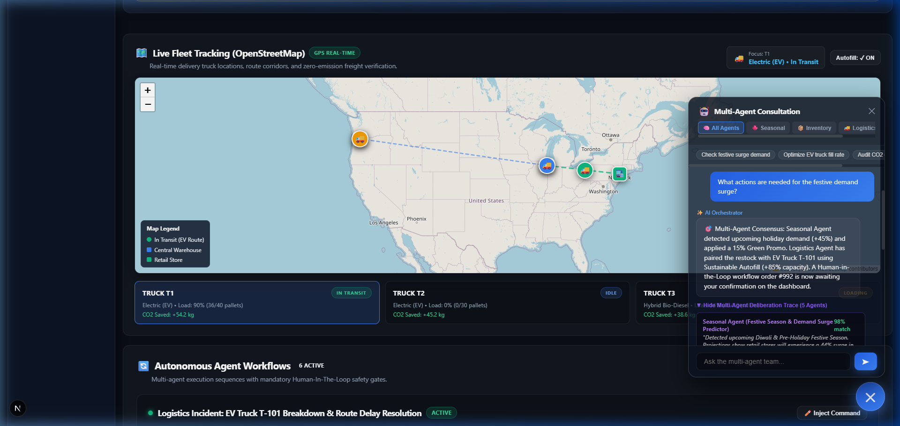

---

### 9. Sustainable Logistics & Eco-Route Corridors
Detailed fleet management tab with battery levels, pallet capacity gauges, and carbon offset tracking:

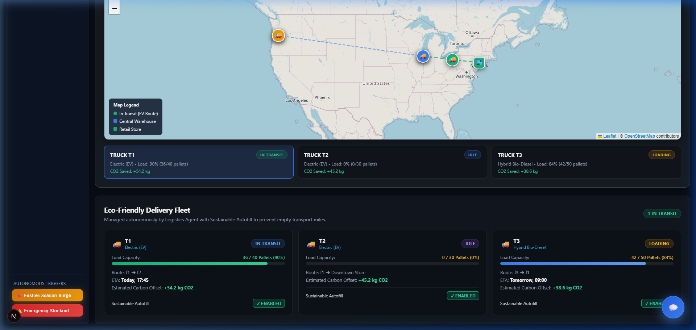

---

## 🏛️ System Architecture

```mermaid
flowchart TD
    subgraph UI ["Modern Frontend (Next.js 16 + Vanilla CSS)"]
        A[Login & Role Selection] --> B[Mission Control Dashboard]
        A --> FB[Warehouse Floor Board (Restricted To-Do Table)]
        B --> C[OpenStreetMap Fleet Tracker]
        B --> D[Human-in-the-Loop Review Gate]
        B --> E[Multi-Agent Consultation Drawer]
        B --> SC[Seasonal Demand Analytics Chart]
    end

    subgraph Backend ["Agentic Backend (FastAPI + Python 3.8+)"]
        F[FastAPI REST API /api]
        G[Config & Multi-Path .env Loader]
        H[(SQLite Database via SQLAlchemy)]
    end

    subgraph MultiAgentEngine ["Autonomous Multi-Agent System"]
        O[AI Orchestrator]
        S[Seasonal Agent]
        I[Inventory Agent]
        L[Logistics Agent]
        Eco[Sustainability Agent]
        WH[Warehouse Agent (Floor Dispatcher)]
    end

    subgraph ExternalServices ["External Engines"]
        LLM[Google Gemini 3.6 Flash API]
        OSM[OpenStreetMap Tile Server]
    end

    UI <-->|JSON REST & Polling| F
    FB <-->|Task Status & Defect Reports| F
    F --> G
    F <--> H
    F <--> O
    O <--> S & I & L & Eco & WH
    WH -->|Autonomous Hand-off| H
    S & I & L & Eco & O & WH <-->|Direct Generation| LLM
    C <-->|Tile Queries| OSM
```

---

## 🚀 Getting Started

### Prerequisites
- **Node.js** 18+ & **npm**
- **Python** 3.8+ & **pip**
- **Google Gemini API Key** (optional: high-fidelity simulated multi-agent mode runs automatically if key is omitted)

---

### 1. Clone the Repository
```bash
git clone https://github.com/tdhanesh1992/agents-demo.git
cd agents-demo
```

---

### 2. Configure Environment Variables
Create `.env.local` files in both `backend/` and `supply-chain-dashboard/`:

#### `backend/.env.local`
```env
GEMINI_API_KEY=your_gemini_api_key_here
```

#### `supply-chain-dashboard/.env.local`
```env
GEMINI_API_KEY=your_gemini_api_key_here
NEXT_PUBLIC_APP_URL=http://localhost:3000
```

> **Note**: The backend automatically searches for `.env.local` and `.env` across `backend/`, `supply-chain-dashboard/`, and the repository root.

---

### 3. Launch Backend (FastAPI)
```bash
cd backend
pip install -r requirements.txt
python -m uvicorn main:app --reload --port 8000
```
- API will be accessible at: `http://localhost:8000`
- Interactive Swagger docs: `http://localhost:8000/docs`

---

### 4. Launch Frontend (Next.js)
In a new terminal window:
```bash
cd supply-chain-dashboard
npm install
npm run dev
```
- Web Application will be live at: `http://localhost:3000`

---

## 🛠️ Technology Stack

| Layer | Technologies |
|---|---|
| **Frontend** | Next.js 16 (Turbopack), React 19, TypeScript, Vanilla CSS (Glassmorphism), Leaflet |
| **Geospatial** | OpenStreetMap (OSM) Cartographic Tiles, Leaflet DivIcons & Polyline Eco-Corridors |
| **Backend** | Python, FastAPI, Uvicorn, SQLAlchemy, Pydantic v2 |
| **AI / Multi-Agent** | Google Gemini 3.6 Flash (`generativelanguage.googleapis.com`), Autonomous Deliberation Protocol |
| **Database** | SQLite (`supplychain.db`) with auto-seeding dummy retail telemetry |

---

## 📡 API Reference Summary

| Endpoint | Method | Description |
|---|---|---|
| `/api/users` | `GET` | List all demo users across Management and Floor Staff roles |
| `/api/products` | `GET` | Retrieve sustainable retail catalog with eco-scores |
| `/api/facilities` | `GET` | Warehouses, retail stores, and vendor inventory |
| `/api/trucks` | `GET` | Fleet status, load capacities, GPS coordinates, fuel powertrain |
| `/api/trucks/{id}/toggle-autofill` | `POST` | Toggle Sustainable Autofill mode for a delivery truck |
| `/api/workflows` | `GET` | Active and completed autonomous workflows |
| `/api/workflows/{wf_id}/steps/{step_id}/approve` | `POST` | Authorize Human-in-the-Loop step with operator notes |
| `/api/workflows/{wf_id}/inject` | `POST` | Inject user command override into active agent workflow |
| `/api/scenarios/trigger` | `POST` | Trigger autonomous scenario (`festive_surge`, `emergency_restock`, `carbon_audit`) |
| `/api/agent-logs` | `GET` | Live inter-agent conversation message stream |
| `/api/chat` | `POST` | Direct multi-agent consultation powered by Gemini 3.6 Flash |
| `/api/warehouse/tasks` | `GET` | List assigned warehouse floor tasks (supports `?role=` filter) |
| `/api/warehouse/tasks/{task_id}/status` | `POST` | Update task status and trigger autonomous downstream hand-offs |
| `/api/warehouse/tasks/report-damage` | `POST` | Log QC defect; quarantines batch and creates urgent replacement pick |
| `/api/seasonal/history` | `GET` | Retrieve past 3 years vs 2026 AI-predicted festive surge demand curves |

---

## 👤 Author

Developed by **Dhanesh T** ([@tdhanesh1992](https://github.com/tdhanesh1992)).

---

## ⚡ Acknowledgements

This project was vibecoded with **Google Antigravity** — Google DeepMind's advanced agentic AI coding assistant.

---

## 📄 License
This project is open-source and licensed under the [MIT License](LICENSE).

"# retail-supply-chain-agents" 
